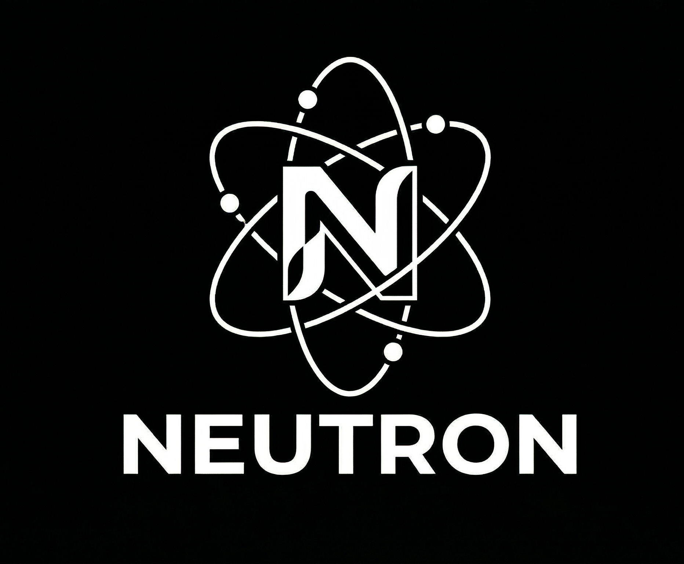

<p align="center">
  
</p>

# 🚀 Neutron v10 - Ultimate Automation & Monitoring Console

**Neutron v10**, sunucu filolarınızı yönetmek, komutları yüksek hızda paralel olarak dağıtmak ve altyapınızı canlı olarak izlemek için tasarlanmış, **Ansible Alternatifi** modern bir otomasyon platformudur. 

Go tabanlı güçlü çekirdeği sayesinde "agentless" (sunuculara ajan kurmadan) çalışır ve Windows/Linux ortamlarında tam performans sağlar.

---

## ✨ Öne Çıkan Özellikler

*   **⚡ Ultra-Hızlı Go Çekirdeği:** Goroutine tabanlı native SSH motoru ile yüzlerce sunucuya milisaniyeler içinde erişim.
*   **🖥️ Modern Web Konsolu:** Flask ve Tailwind CSS ile geliştirilmiş, kullanıcı dostu ve profesyonel karanlık mod arayüzü.
*   **📂 Native Dosya Transferi:** Sunuculara dosya yükleme (Push) ve veri çekme (Pull - recursive) desteği.
*   **🛡️ Gelişmiş Güvenlik:** `StrictHostKeyChecking` desteği ve her işlemin kullanıcı bazlı kaydedildiği `Audit Log` sistemi.
*   **📊 Canlı İzleme:** Sunucuların Online/Offline durumlarını anlık olarak takip eden Dashboard.
*   **📜 Playbook Runner:** Önceden tanımlanmış komut setlerini tek tıkla tüm filonuza uygulama.

---

## 🏗️ Mimari Yapı

Neutron v10, "Doğru iş için doğru araç" prensibiyle hibrit bir yapıda inşa edilmiştir:

1.  **Core (Motor):** `neutron-core.exe` (Go) - SSH iletişimi, paralel çalışma ve dosya transferinden sorumludur.
2.  **Backend (Sunucu):** `Flask` (Python) - Kullanıcı yönetimi, API katmanı ve arayüz servislerini yönetir.
3.  **Frontend (Arayüz):** `Vanilla JS/CSS` - Canlı terminal akışları ve dinamik dashboard verileri.

---

## 🚀 Kurulum ve Çalıştırma

### 1. Gereksinimler
*   Python 3.x
*   Go 1.2+ (Geliştirme yapılacaksa)
*   Hedef sunucularda SSH erişimi

### 2. Kurulum
Bağımlılıkları yükleyin:
```bash
pip install -r requirements.txt
```

### 3. Yapılandırma
`config.yaml` dosyasını kendi sunucularınıza göre düzenleyin:
```yaml
ssh_user: "root"
private_key_file: "~/.ssh/neutron.key"
strict_host_key_checking: "no"
hosts:
  - "192.168.1.100:22"
  - "192.168.1.101:22"
```

### 4. Başlatma
Uygulamayı çalıştırın:
```bash
py app.py
```
Ardından tarayıcınızdan `http://localhost:2300` adresine gidin.

---

## 🛠️ Kullanım Rehberi

### Terminal Komutları
Terminal sekmesine bir komut (Örn: `uptime` veya `df -h`) girdiğinizde, Go çekirdeği otomatik olarak tüm sunuculara paralel bağlanır ve çıktıları canlı olarak terminale akıtır.

### Dosya Transferi (CLI üzerinden)
*   **Gönder:** `neutron-core.exe -push local.txt:/tmp/remote.txt`
*   **Çek:** `neutron-core.exe -pull /var/log/syslog:./backup/`

---

## 📝 Lisans ve Denetim
Tüm işlemler `audit_log.txt` dosyasına `USER_ID | COMMAND` formatında kaydedilir. Bu dosya yöneticiler için tam izlenebilirlik sağlar.

---

**Developed with ❤️ for High Performance Systems.**
