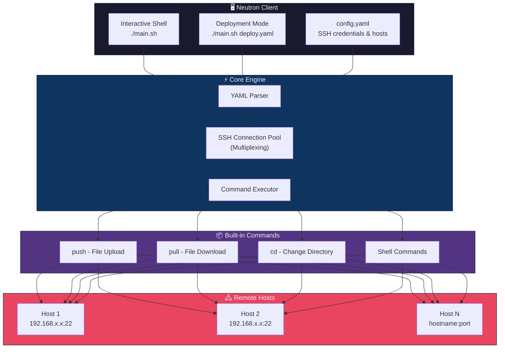

# Neutron v10 - Automation Tool
## Lightweight and Powerful automation tool for Linux/Unix Ansible Alternative Project

It is a lightweight, fast, and Powerful For security reasons, it will only support connection via SSH key.

"StrictHostKeyChecking=no"
Disables host key verification on SSH connections. This can create a MITM (Man-in-the-Middle) vuln.

Only for Linux systems. Support for Windows systems has been discontinued.

(eval) executes the given expression as a shell string (full text). It is therefore very powerful. Use with caution!

# Neutron v10 - Automation Tool
- Version: 10
- Author: faruk-guler | github.com/faruk-guler
- Date: 2025
## Usage:
> chmod 600 config.yaml ~/.ssh/neutron.key
>
> chmod 700 main.sh
> 
> ./main.sh
> 
> ./main.sh deploy.yaml # Automated deployment
> 
> shell # push /local/path/file.txt /remote/path/  # Parallel upload
> 
> shell # pull /var/log/app.log ./logs/  # Parallel down.
~~~sh
# Neutron Structure:
├── config.yaml # Configuration (credentials and hosts)
├── main.sh     # Main tool (bash runs commands)
├── deploy.yaml # Deployment playbook
~~~
~~~sh
# Start SSH Agent and load the Private key into the agent:
eval "$(ssh-agent -s)"
ssh-add /root/.ssh/neutron.key
~~~

# Requirements:
- SSH key passphrases
- SSH service and ports

