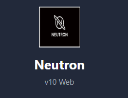

# Neutron v10 Web - Automation Platform

<div align="center">
  
</div>

**Lightweight, Powerful, and Modern Web-Based Infrastructure Automation Tool**

[](https://opensource.org/licenses/Apache-2.0)
[](https://www.python.org/)
[](https://nodejs.org/)

## ✨ Features

- 🖥️ **Modern Web UI** - Beautiful, responsive dashboard with real-time updates
- 🚀 **Parallel Execution** - Run commands on multiple hosts simultaneously
- 📂 **File Manager** - Push/pull files across hosts with ease
- 📜 **Playbooks** - Create and automate multi-step deployments
- 💻 **Interactive Terminal** - Real-time terminal with xterm.js
- 📊 **Dashboard** - Monitor infrastructure with live statistics and charts
- 📝 **Command History** - Track all executed commands
- 🔒 **SSH Key-Based Auth** - Secure, password-less authentication
- ⚡ **FastAPI Backend** - High-performance async API
- 🎨 **React + TailwindCSS** - Modern, customizable frontend

## 🚀 Quick Start

### Prerequisites

- Python 3.8+
- Node.js 18+
- SSH key for host authentication

### Installation

**Windows:**
```powershell
.\setup-web.bat
```

**Linux/Mac:**
```bash
chmod +x setup-web.sh
./setup-web.sh
```

### Manual Setup

**Backend:**
```bash
cd backend
python -m venv venv
source venv/bin/activate  # Linux/Mac
# or
venv\Scripts\activate     # Windows

pip install -r requirements.txt
```

**Frontend:**
```bash
cd frontend
npm install
npm run build
```

### Running

**Production Mode (Single Server):**
```bash
cd backend
source venv/bin/activate  # or venv\Scripts\activate on Windows
uvicorn main:app --host 0.0.0.0 --port 8080
```

**Development Mode (Two Servers):**
```bash
# Terminal 1 - Backend
cd backend
source venv/bin/activate
uvicorn main:app --host 0.0.0.0 --port 8080

# Terminal 2 - Frontend
cd frontend
npm run dev
```

### Access

- **URL**: http://localhost:8080
- **API Docs**: http://localhost:8080/docs
- **ReDoc**: http://localhost:8080/redoc

## 🔧 Configuration

### SSH Key Setup

Generate SSH key pair:
```bash
ssh-keygen -t ed25519 -f ~/.ssh/neutron.key
chmod 600 ~/.ssh/neutron.key
```

Distribute public key to hosts:
```bash
ssh-copy-id -i ~/.ssh/neutron.key.pub root@192.168.1.100
```

### Import from Config File

Neutron Web can automatically import hosts from `config.yaml`:

```yaml
ssh_user: "root"
private_key_file: "~/.ssh/neutron.key"
strict_host_key_checking: "no"

hosts:
  - "192.168.1.100:22"
  - "192.168.1.101:22"
```

Place `config.yaml` in the project root and hosts will be auto-imported on startup.

## 📖 API Documentation

Once the backend is running, visit http://localhost:8080/docs for interactive API documentation.

### Key Endpoints

```
GET    /api/hosts                - List all hosts
POST   /api/hosts                - Add new host
PUT    /api/hosts/{id}           - Update host
DELETE /api/hosts/{id}           - Delete host
POST   /api/hosts/{id}/connect   - Connect to host
POST   /api/commands/execute     - Execute command
POST   /api/files/push           - Upload file
POST   /api/files/pull           - Download file
GET    /api/playbooks            - List playbooks
POST   /api/playbooks            - Create playbook
POST   /api/playbooks/execute    - Run playbook
GET    /api/history              - Command history
GET    /api/dashboard            - Dashboard stats
```

## 🎯 Usage Examples

### 1. Add Hosts

Navigate to `/hosts` and click "Add Host" or use the API:

```bash
curl -X POST http://localhost:8080/api/hosts \
  -H "Content-Type: application/json" \
  -d '{
    "name": "web-server-1",
    "ip_address": "192.168.1.100",
    "port": 22,
    "user": "root"
  }'
```

### 2. Execute Commands

Use the Terminal page at `/terminal`:
1. Select target hosts
2. Enter command (e.g., `uptime`, `df -h`)
3. Click Execute to run on all selected hosts in parallel

### 3. Create Playbook

Navigate to `/playbooks`:
1. Click "New Playbook"
2. Add commands sequentially
3. Select target hosts
4. Execute with one click

Example playbook:
```
Name: Deploy Web App
Commands:
  1. systemctl stop nginx
  2. cd /var/www && git pull
  3. systemctl start nginx
  4. systemctl status nginx
```

### 4. Transfer Files

Use the Files page at `/files`:
- **Push**: Upload local file to multiple hosts
- **Pull**: Download remote file from multiple hosts

## 🛡️ Security

- SSH key-only authentication (no passwords)
- Configurable StrictHostKeyChecking
- Input sanitization on all endpoints
- SQLite database with proper permissions
- CORS configured for production use

## 📁 Project Structure

```
neutron-v10-web/
├── backend/
│   ├── main.py              # FastAPI application
│   ├── ssh_manager.py       # SSH connection pool
│   ├── commands.py          # Command executor
│   ├── models.py            # SQLAlchemy models
│   └── requirements.txt     # Python dependencies
├── frontend/
│   ├── src/
│   │   ├── App.jsx          # Main app router
│   │   ├── main.jsx         # React entry point
│   │   ├── components/      # Reusable components
│   │   ├── pages/           # Page components
│   │   └── services/        # API client
│   ├── package.json
│   └── vite.config.js
├── config.yaml              # SSH configuration & hosts
├── .env.example             # Environment variables template
├── setup-web.bat            # Windows setup script
├── setup-web.sh             # Linux/Mac setup script
└── README.md
```

## 🤝 Contributing

1. Fork the repository
2. Create your feature branch (`git checkout -b feature/amazing-feature`)
3. Commit your changes (`git commit -m 'Add amazing feature'`)
4. Push to the branch (`git push origin feature/amazing-feature`)
5. Open a Pull Request

## 📄 License

Apache License 2.0 - See [LICENSE](LICENSE) for details

## 👥 Author

**faruk-guler** - [github.com/faruk-guler](https://github.com/faruk-guler)

## 🙏 Acknowledgments

- FastAPI for the amazing backend framework
- React and the frontend ecosystem
- Paramiko for SSH support
- xterm.js for terminal emulation

---

**Neutron v10 Web** - Modern infrastructure automation made simple ⚡
